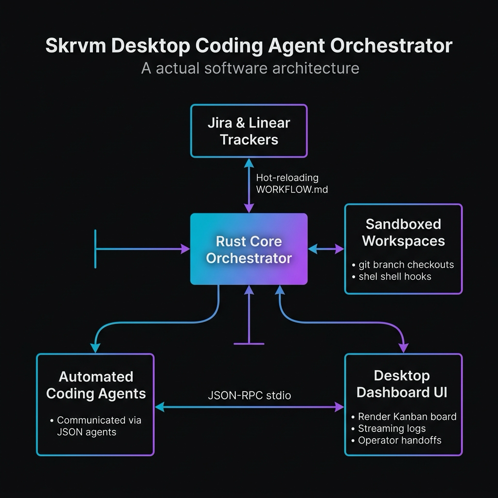
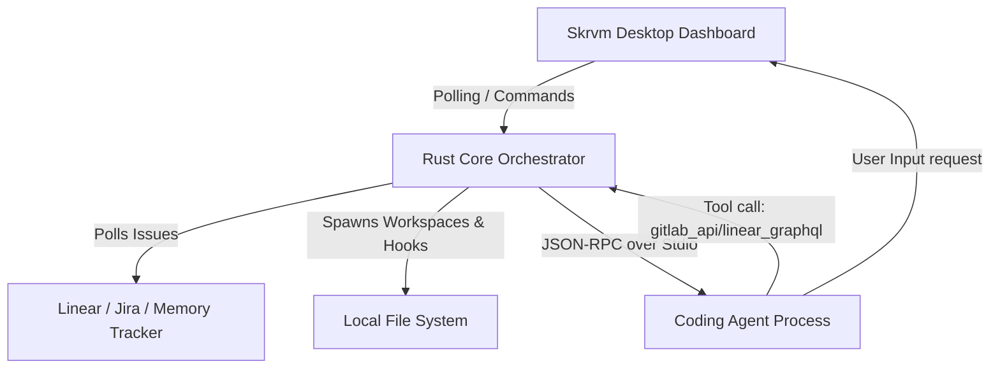

# Skrvm Orchestrator 🎛️



> **skrvm** (pronounced _scrum_) is a state-of-the-art desktop coding agent
> orchestrator built on **Tauri v2**, **React 19**, **TypeScript**, and
> **Rust**.

It transforms standard issue trackers (Linear, Jira) into automated workflows,
managing local sandboxed workspaces, coordination logic, and high-trust
background coding agents.



---

## 🌟 Key Features

- **Dynamic Workflow Polling (`WORKFLOW.md`)**: Hot-reloads configuration
  automatically every 1.5 seconds from a local `WORKFLOW.md` file. The prompt
  and agent behaviors are defined using inline **MiniJinja** (Jinja2-compatible)
  templates.
- **Multiple Trackers Support**: Out-of-the-box integration with **Jira**,
  **Linear**, and a mock **Memory** tracker for local development.
- **Surgical Path Safety**: Employs absolute directory containment checks,
  prefix validation, and workspace directory sanitization.
- **JSON-RPC Agent Protocol**: Coordinates complex coding agents via `stdio`
  using standard JSON-RPC. Automatically handles command approvals, file patch
  approvals, tool execution, and token usage metrics.
- **Operator-in-the-Loop Handoff**: When a coding agent requires manual
  intervention (e.g. asking for missing keys or domain decisions), Skrvm
  suspends the agent and shifts the ticket into **Human Review**. Operators can
  inspect the full context, provide manual guidance via the UI, and resume
  execution seamlessly.
- **Advanced Scheduling & Concurrency**:
  - Concurrently runs up to `$max_concurrent_agents` tasks.
  - Enforces state-level concurrency limits.
  - Prioritizes tickets based on tracker rankings and dates.
  - Blocks tasks from executing if their upstream ticket dependencies are
    non-terminal.
- **Exponential Backoff Retries**: Handles environment errors or test failures
  by scaling delays up to a custom limit.

---

## 🔌 Supported Integrations & Compatibility

Skrvm orchestrates a unified runtime for diverse coding agents and external
issue trackers:

### Coding Agents

| Agent / CLI                 | Configuration Block            | Default Command    | Protocol / Handshake  |
| :-------------------------- | :----------------------------- | :----------------- | :-------------------- |
| **Antigravity CLI** (`agy`) | `agents`, `agy`, `antigravity` | `codex app-server` | JSON-RPC over `stdio` |
| **Kiro** (`kiro`)           | `agents`, `kiro`               | `codex app-server` | JSON-RPC over `stdio` |
| **Codex** (`codex`)         | `agents`, `codex`              | `codex app-server` | JSON-RPC over `stdio` |

### Issue Trackers & VCS

| Service    | Tracker `kind` | Authentication Token | Capabilities                                                     |
| :--------- | :------------- | :------------------- | :--------------------------------------------------------------- |
| **Linear** | `linear`       | `$LINEAR_API_KEY`    | Candidates polling, active filter, dynamic `linear_graphql` tool |
| **Jira**   | `jira`         | `$JIRA_API_KEY`      | Candidates polling, active transition syncing                    |
| **GitHub** | `github`       | `$GITHUB_TOKEN`      | Repository-linked issue tracking, branch creation                |
| **GitLab** | `gitlab`       | `$GITLAB_TOKEN`      | Workspace integration, dynamic `gitlab_api` tool                 |
| **Memory** | `memory`       | None                 | Zero-credentials offline sandbox, mock issue pipeline            |

---

## 🏗️ System Architecture & Mechanics

### 1. The Core Orchestrator Loop (`orchestrator.rs`)

The background engine runs a continuous loop driven by `tick()`. In each tick,
the orchestrator:

1. **Polls `WORKFLOW.md`**: Detects changes using metadata and hashes.
   Hot-reloads the settings block and MiniJinja prompt template without
   restarting the application.
2. **Reconciles Active Workers**: Refreshes running issue states from the active
   tracker, terminating processes if the ticket was completed/canceled
   externally.
3. **Applies Concurrency Rules**: Checks global and state-level slots before
   dispatching new issues.
4. **Enforces Upstream Dependencies**: For "Todo" tickets, blocks dispatching if
   any issue listed in `blocked_by` is not in a terminal state.

### 2. Local Workspace Preparation (`agent_runner.rs`)

Each active ticket receives a dedicated sandboxed workspace directory inside the
`workspace.root`:

- **Sanitization**: Sanitizes the issue identifier (e.g., `PROJ-123`) to
  alphanumeric safe path names.
- **Hook Execution**:
  - Runs `after_create` (e.g., `git init`) immediately after directory creation.
  - Runs `before_run` (e.g., `pnpm install`) before spawning the agent.
  - Runs `after_run` (e.g., `git commit -m 'incremental progress'`) after each
    successful turn.

---

## 🔗 Using Skrvm with Other Projects

Since Skrvm isolates coding agent execution into sandboxed, issue-specific
directories, it is designed from the ground up to orchestrate code generation on
external repositories.

### The Sandbox Workspace Strategy

Each ticket matched by your active issue tracker is assigned a dedicated
subdirectory within the `workspace.root` folder
(e.g.`~/dev/scratch/skrvm/workspaces/PROJ-123`). This architecture ensures that
concurrent workers never interfere with each other or step on a single shared
codebase folder.

To manage and automate coding agents operating on your existing codebases,
configure Skrvm's dynamic shell hooks:

1. **Bootstrapping (`hooks.after_create`)**: Runs immediately after creating the
   sandbox folder. Use it to clone your target repository and set up a
   ticket-specific branch:

   ```yaml
   hooks:
     after_create: "git clone --depth 1 git@github.com:my-org/my-project.git . && git checkout -b feature/skrvm-{{ issue.identifier }}"
   ```

2. **Dependency Setup (`hooks.before_run`)**: Executes before spawning the
   Codex/Kiro agent. Ensures all modules and tools required by the codebase are
   present:

   ```yaml
   hooks:
     before_run: "pnpm install"
   ```

3. **Commit & Push Progress (`hooks.after_run`)**: Runs automatically after a
   turn successfully concludes. Use it to stage all modified files, record
   progress, and push updates back to your remote git origin:

   ```yaml
   hooks:
     after_run: "git add . && git commit -m 'skrvm: turn progress' --allow-empty && git push origin HEAD"
   ```

### Dynamic Env Resolution

All credentials and sensitive keys (such as `api_key` or `assignee`) support
environment variable resolution. Simply prefix the variable name with a `$`
character (e.g., `api_key: "$JIRA_API_KEY"`), and Skrvm will dynamically extract
the value from your host process env.

### Real-World Configuration Templates

We provide three documented, production-ready workflow blueprints inside the
[examples/](file:///Users/drew.simmons/dev/personal/github/skrvm/examples/)
directory:

- [examples/WORKFLOW.memory.md](file:///Users/drew.simmons/dev/personal/github/skrvm/examples/WORKFLOW.memory.md):
  Configures local offline mock runs using mock issues and standard stdio-mock
  scripts.
- [examples/WORKFLOW.jira.md](file:///Users/drew.simmons/dev/personal/github/skrvm/examples/WORKFLOW.jira.md):
  Configures real Jira integrations with target codebase checkout pipelines.
- [examples/WORKFLOW.linear.md](file:///Users/drew.simmons/dev/personal/github/skrvm/examples/WORKFLOW.linear.md):
  Configures real Linear integrations with target codebase checkout pipelines.

---

## ⚙️ Workflow Configuration (`WORKFLOW.md`)

The entire system behavior is controlled by `WORKFLOW.md`, which uses a
double-dash split format: a **YAML Frontmatter** config block followed by a
**MiniJinja system prompt template**.

````yaml
---
tracker:
  kind: "jira"                           # Supported: "jira", "linear", or "memory"
  endpoint: "https://your-domain.atlassian.net"
  api_key: "$JIRA_API_KEY"               # Env variables resolved with '$' prefix
  project_slug: "PROJ"
  assignee: "$JIRA_ASSIGNEE"             # Optional: Filter by assignee (can use "me" for Linear)
  active_states:
    - "Todo"
    - "In Progress"
  terminal_states:
    - "Closed"
    - "Done"

polling:
  interval_ms: 30000                      # How often to check for tracker updates

workspace:
  root: "~/dev/scratch/skrvm/workspaces"  # Tilde ~ and env variables supported

agent:
  max_concurrent_agents: 5
  max_turns: 20
  max_retry_backoff_ms: 300000

agents:
  command: "codex app-server"             # Terminal command to launch the agent (e.g. codex, kiro, agy)
  thread_sandbox: "workspace-write"
  turn_timeout_ms: 3600000

hooks:
  after_create: "git init && git config user.name 'Skrvm Worker'"
  before_run: "pnpm install"
  after_run: "git add . && git commit -m 'skrvm: incremental progress' --allow-empty"
  timeout_ms: 60000
---

You are Antigravity, an elite agentic coding assistant spawned by the Skrvm
orchestrator to resolve ticket **{{ issue.identifier }}**.

### Task Overview
- **Title**: {{ issue.title }}
- **Status**: {{ issue.state }}

#### Description
```markdown
{{ issue.description }}
```
````

---

## 🤖 JSON-RPC Agent Protocol & Handshake

Skrvm interacts with the coding agent process over standard streams
(`stdin`/`stdout`) using a standard JSON-RPC handshake:

```text
[Orchestrator]                             [Agent Process]
      |                                           |
      | ------ initialize (RPC Request) --------> |
      | <----- initialize (RPC Response) -------- |
      |                                           |
      | ------ initialized (Notification) ------> |
      |                                           |
      | ------ thread/start (RPC Request) ------> |
      | <----- thread/start (RPC Response) -----> |
      |                                           |
      | ------ turn/start (RPC Request) --------> |
      | <----- turn/start (RPC Response) -------- |
      |                                           |
      | [Streaming Turn Reader Loop Starts]       |
      |                                           |
      | <--- execCommandApproval (Request) ------ |  [Auto-Approved by default]
      | ---- execCommandApproval (Approve) -----> |
      |                                           |
      | <--- applyPatchApproval (Request) ------- |  [Auto-Approved by default]
      | ---- applyPatchApproval (Approve) ------> |
      |                                           |
      | <--- item/tool/call (linear/gitlab) ----- |  [Executed by Skrvm credentials]
      | ---- item/tool/call (Response) ---------> |
      |                                           |
      | <--- item/tool/requestUserInput --------  |  [Operator Handoff triggered]
      |                                           |
```

### Dynamic Tools Provided by Skrvm

Instead of configuring multiple tool authentications directly inside the agent,
Skrvm injects credentials at the orchestrator layer and exposes two dynamic
tools to the agent:

1. **`linear_graphql`**: Allows the agent to run raw GraphQL queries against
   Linear using the orchestrator's auth token.
2. **`gitlab_api`**: Exposes the GitLab REST/GraphQL API using the
   orchestrator's GitLab credentials.

---

## 🖥️ UI Dashboard Tour

The frontend dashboard is designed to provide maximum visibility into background
operations:

- **Live Kanban Board**: Real-time status cards grouped into **Backlog / Todo**,
  **In Progress**, **Human Review**, and **Done** columns.
- **Slide-Out Inspect Drawer**: Click any ticket card to inspect its session
  context:
  - **Session Parameters**: Live tracker stats, active Process ID (PID),
    memory/host information, branch, and token metrics.
  - **Automated Checklist Plan**: Dynamically displays a visual step-by-step
    turn progression indicating which tasks have completed and which are
    currently running.
  - **Vintage macOS Badge Sandbox**: Interactive demonstration panel built using
    vintage macOS-styled badges showing TodoMVC filter logic.
  - **Operator Handoff Panel**: Exposes custom text area inputs allowing users
    to supply direct instruction and unblock suspended agent sessions.
  - **Streaming Live Execution Logs**: Feeds terminal logs from the active
    subprocess stdio streams straight to the UI log viewer.

---

## 🚀 Step-by-Step Setup Guide

Follow this guide to get Skrvm running locally and orchestrating coding agents.

### 📋 Prerequisites

Ensure the following tools are installed on your machine:

- [Rust & Cargo](https://rustup.rs/) (v1.75+ or newer)
- [Node.js](https://nodejs.org/) (v18+ or newer)
- [pnpm](https://pnpm.io/) (`npm i -g pnpm`)

### 1. Clone the Codebase

```bash
git clone https://github.com/drew-simmons/skrvm.git
cd skrvm
```

### 2. Install Project Dependencies

Use `pnpm` to install node modules and verify typescript targets:

```bash
pnpm install
```

### 3. Setup Your `WORKFLOW.md` Config File

Create a `WORKFLOW.md` file in the root directory. You can use the `Memory`
tracker for a zero-credentials offline test.

For a mock run, setup this file:

```yaml
---
tracker:
  kind: "memory"
  endpoint: ""
  api_key: ""
  project_slug: "DEMO"
  active_states:
    - "Todo"
  terminal_states:
    - "Done"

polling:
  interval_ms: 10000

workspace:
  root: "~/dev/scratch/skrvm/workspaces"

agent:
  max_concurrent_agents: 2
  max_turns: 5

codex:
  command: "./scratch/mock_agent.sh"
  thread_sandbox: "workspace-write"
---
You are a helpful coding agent. Solve this:
Issue: { { issue.title } }
```

_(Optional)_ Create a simple mock script `./scratch/mock_agent.sh` that prints
out mock JSON-RPC responses to simulate turn progression:

```bash
mkdir -p scratch
cat << 'EOF' > scratch/mock_agent.sh
#!/bin/bash
# Mock Agent Stdio Handshake Script
read -r line # Read initialize
echo '{"id":1,"result":{"capabilities":{}}}'
read -r line # Read initialized
read -r line # Read thread/start
echo '{"id":2,"result":{"thread":{"id":"mock-thread-id"}}}'
read -r line # Read turn/start
echo '{"id":3,"result":{"turn":{"id":"mock-turn-id"}}}'
sleep 3
echo '{"method":"turn/completed","params":{"usage":{"input_tokens":120,"output_tokens":80}}}'
EOF
chmod +x scratch/mock_agent.sh
```

### 4. Run the Desktop Application in Dev Mode

Start the Vite frontend development server and the Tauri window wrapper:

```bash
pnpm tauri dev
```

The application window will launch, presenting the
**Skrvm Orchestrator Console** with visual indicators monitoring token
consumption and active workers.

### 5. Managing Blocks & Operator Input

If an agent returns `item/tool/requestUserInput` in the stdio logs:

1. The card will automatically move to the **Human Review** column.
2. Click the card to slide out the inspection drawer.
3. Scroll to the **Skrvm Operator Handoff** panel.
4. Input manual guidance/instructions in the text area.
5. Click **Resolve and Resume** to unblock and continue.

---

## 🛠️ Developer Scripts & Formatting

Always format your code before creating pull requests:

- **Format Frontend**: `pnpm fmt:ts`
- **Format Backend**: `pnpm fmt:rust`
- **Lint All**: `pnpm lint`
- **Check Rust compilation**: `pnpm check:rust`
