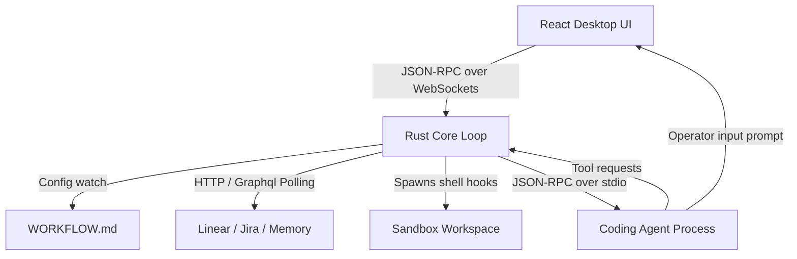
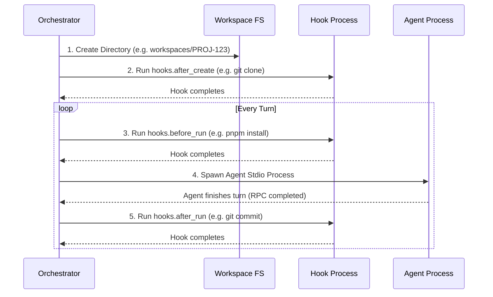

Skrvm Orchestrator balances safety and velocity by marrying a multi-threaded
Rust scheduler with sandbox workspaces. This guide details how the background
orchestrator works under the hood.

---

## 🏗️ Architecture Blueprint

The diagram below illustrates the interactions between the desktop frontend, the
Rust core loop, the VCS issue tracker, the sandbox workspaces, and the
background coding agents:

---

## ⏰ The Core Orchestrator Loop (`orchestrator.rs`)

The heart of Skrvm is a continuous, asynchronous background loop driven by
`tick()`. In each execution cycle, the orchestrator performs the following
actions:

### 1. Watch & Reload Config

Reads the local `WORKFLOW.md`'s last-modified timestamp and cryptographic hash.
If a change is detected, it hot-reloads the configuration and the system prompt
dynamically. Active runs adapt immediately on their next turn.

### 2. Tracker Sync & Ticket Reconciliation

Polls the configured tracker (e.g. Jira or Linear). It retrieves all tickets
matching the target search query or assignee filter. If a ticket has been
closed, resolved, or deleted externally by a human operator, the orchestrator
immediately cancels the associated local agent task to preserve system memory
and API tokens.

### 3. Apply Concurrency & Upstream Rules

Checks whether global concurrency constraints are satisfied.

* Enforces a global agent process count cap (`max_concurrent_agents`).
* Resolves ticket dependency trees. If a ticket lists other non-resolved issues
  in its `blocked_by` array, the orchestrator prevents it from entering the
  active queue until all upstream tasks reach a terminal state.

### 4. Workspace Dispatching

Spawns a background task (`agent_runner.rs`) to process eligible backlog
tickets.

---

## 📂 Sandbox Workspaces (`agent_runner.rs`)

To ensure complete isolation and absolute containment, Skrvm creates a
completely separate directory for every active ticket inside `workspace.root`.

### 1. Workspace Sanitization

The workspace folder name is created using the issue's unique identifier (e.g.,
`PROJ-123`). This identifier is sanitized to contain only alphanumeric
characters to prevent directory traversal attacks or invalid character errors on
the host filesystem.

### 2. Lifecycle Shell Hooks

Every workspace undergoes a series of lifecycle phases driven by shell hooks:

* **`after_create`**: Executed immediately after directory creation. Commonly
  used to clone a repository into the workspace root.
* **`before_run`**: Executed before launching each turn. Ensures that packages
  are installed and that local dev servers/linters are present.
* **`after_run`**: Executed when a turn successfully finishes. Records progress,
  runs automated tests, and can stage/commit code.

---

## 🚦 Path Safety & Bounds Validation

Skrvm takes path containment very seriously. Since background agents run
arbitrary code and manipulate file content, the Rust backend implements strict
safety assertions before completing any file read or write operation:

* **Prefix Validation**: The orchestrator checks that every requested path
  strictly starts with the resolved absolute path of the ticket's workspace
  subdirectory.
* **Boundary Audits**: Any path containing `..` or relative directory jumps is
  instantly rejected, causing a sandbox violation.
* **System Protection**: Standard system directories (such as `/etc`, `/usr`, or
  the host home root) are fully isolated from the agent's visibility.
