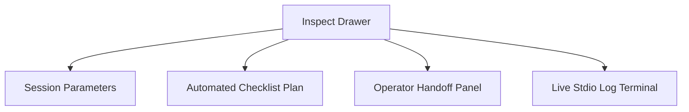

Skrvm Orchestrator's React-based desktop dashboard gives operators complete
visibility and direct control over background execution. This guide explains how
to monitor telemetry, inspect runs, and resolve suspended coding sessions.

---

## 🗂️ The Live Kanban Board

The dashboard organizes active workspace processes into a structured Kanban
layout with four distinct state columns:

1. **Backlog / Todo**: Issues retrieved from the issue tracker that are
   scheduled for execution but have not yet been assigned a workspace or
   subprocess runner.
2. **In Progress**: Active coding turns. A green pulse indicates a running
   subprocess, complete with real-time execution steps and active token
   consumption tracking.
3. **Human Review**: Suspended workflows awaiting operator input. Cards
   automatically shift here if the agent requests credentials or reaches an
   ambiguous architectural decision point.
4. **Done**: Workspace threads that successfully resolved their issues,
   committed their changes, and exited cleanly.

---

## 🎛️ Live Metrics Telemetry

The top bar displays live global metrics:

* **Active Workers**: Number of active coding processes compared to the
  `max_concurrent_agents` cap.
* **Total Tokens**: Live cumulative token usage (Input / Output) across all
  active workspaces.
* **Total Cost**: Approximate cost of all active turns based on standard API
  rates.
* **Success Rate**: Percentage of completed turns that successfully passed local
  verification test suites.

---

## 🗖 Slide-Out Inspect Drawer

Clicking on any ticket card slides open the **Inspect Drawer**, presenting a
dense summary of the background thread:

### 1. Session Parameters

Displays live operating metrics:

* **PID**: Process Identifier of the active agent subprocess.
* **Branch**: Target git branch created for this specific ticket.
* **Host Stats**: CPU usage and memory footprint of the host machine running the
  runner.
* **Telemetry**: Accumulative token count and turnaround time for the specific
  workspace.

### 2. Automated Checklist Plan

Renders a dynamic visual checklist of the execution path. For example, during an
integration:

* `[x]` Create workspace directory
* `[x]` Pull repository clone
* `[/]` Execute before_run hook (installing dependencies)
* `[ ]` Initialize Agent JSON-RPC turned process
* `[ ]` Complete file patch revisions

This plan gives you a clear visual indicator of exactly what the agent is doing
at any given second.

### 3. Operator Handoff Panel

When an agent triggers an operator input request (`item/tool/requestUserInput`),
the ticket halts and the drawer displays a custom text input area:

1. Inspect the **Streaming Live Execution Logs** or the agent's prompt to
   understand the bottleneck.
2. Type direct instruction or provide missing keys (e.g. `$API_KEY_SECRET`) in
   the handoff text area.
3. Click **Resolve and Resume**. The orchestrator resumes the subprocess, pipes
   your text back as the JSON-RPC response, and the agent continues seamlessly.

### 4. Streaming Live Execution Logs

Feed stdio lines (`stdout` and `stderr`) straight from the agent's background
subprocess into a retro, high-density terminal log viewer. Filter options allow
you to isolate tool calls, error stack traces, or general agent outputs.
